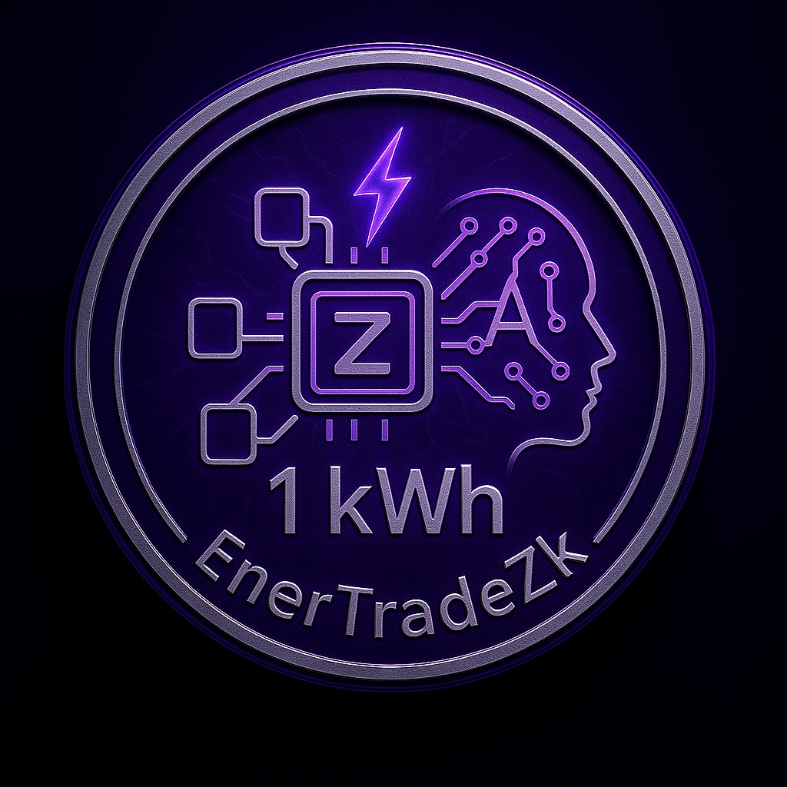

# ⚡ EnerTradeZK

**EnerTradeZK** é uma corretora descentralizada de ativos energéticos tokenizados com foco em **privacidade, acessibilidade e inovação social**. A plataforma foi desenvolvida para permitir que **qualquer cidadão participe do mercado de energia elétrica** de forma segura, com **ZK-Proofs (zero-knowledge proofs)** garantindo a privacidade de dados como consumo, identidade e saldo.

---

## 🔋 Objetivo do Projeto

Democratizar o acesso ao mercado de energia, promovendo inclusão e segurança:
- Como **consumidor**, o usuário pode adquirir energia mais barata diretamente de quem produz ou vende.
- Como **investidor**, qualquer pessoa pode negociar kWh tokenizados de forma peer-to-peer.
- Com **zk-SNARKs**, garantimos privacidade total dos dados sensíveis off-chain.

---

## 🪙 Token

- **Nome:** EnerZ
- **Lastro:** 1 EnerZ = 1 MWh
- **Blockchain:** Ethereum (Testnet Sepolia)
- **Privacidade:** Implementada com Circom + SnarkJS

---

## 🛠️ Tecnologias Utilizadas

| Camada              | Tecnologia                             |
|---------------------|----------------------------------------|
| Blockchain          | Ethereum Sepolia                       |
| Contratos           | Solidity com Hardhat                   |
| Backend             | Node.js + Express + SnarkJS            |
| ZK-Proofs           | Circom + SnarkJS                       |
| RPC Provider        | Infura                                 |
| Provedor de Carteira| MetaMask                               |

---

## 📁 Estrutura do Projeto

```bash
EnerTradeZK/
├── artifacts/              # Arquivos compilados dos contratos inteligentes gerados pelo Hardhat (bytecode, ABIs, etc.).
├── assets/                 # Recursos estáticos como imagens, logos e ícones usados na interface ou documentação.
├── cache/                  # Cache do Hardhat, usado para acelerar compilações e execuções repetidas.
├── circuits/               # Circuitos ZK (Zero-Knowledge), geralmente escritos em linguagens como Circom. Contêm as lógicas de verificação privada.
├── contracts/              # Contratos inteligentes escritos em Solidity. Aqui estão os contratos que definem a lógica de tokenização de energia, mercado, etc.
├── ignition/               # Scripts e arquivos de configuração para o **Ignition** do Hardhat (ferramenta moderna de deploy e testes automáticos).
├── node_modules/           # Diretório gerado pelo npm/yarn com todas as dependências do projeto instaladas.
├── scripts/                # Scripts auxiliares para deploy, interações com contratos ou geração de provas ZK. Executados via Hardhat.
├── test/                   # Testes automatizados dos contratos, geralmente escritos em JavaScript ou TypeScript usando frameworks como Mocha/Chai.
├── zk/                     # Pasta complementar aos circuitos ZK. Pode conter provas geradas, verificadores, setups de trusted setup, etc.
├── .gitattributes          # Configurações de atributos Git, como tratamento de arquivos de texto e merge.
├── hardhat.config.js       # Arquivo de configuração do Hardhat: define paths, redes, compilador, plugins, etc.
├── LICENSE                 # Licença MIT indicando que o código é de uso livre com atribuição.
├── package-lock.json       # Arquivo de lock do npm, que garante a consistência das versões de dependências.
├── package.json            # Lista de dependências, scripts npm, metadados do projeto.
└── README.md               # Documentação principal com visão geral, instruções de uso, instalação e exemplos.

```

---

## 🛠️ Como rodar o projeto localmente

✅ Pré-requisitos

Certifique-se de ter os seguintes softwares instalados:

Node.js
```bash
nvm install --lts
```

nvm Linux
```bash
curl -o- https://raw.githubusercontent.com/nvm-sh/nvm/v0.39.7/install.sh | bash
```

nvm Windows
```bash
wget -qO- https://raw.githubusercontent.com/nvm-sh/nvm/v0.39.7/install.sh | bash
```

Git

Baixe aqui:
👉 https://git-scm.com/download/win

Siga as orientações padrão na instalção.

Docker (caso vá usar contêiner para serviços auxiliares)

Baixe aqui:
👉 https://www.docker.com/products/docker-desktop/

Requisitos:

Windows 10/11 64-bit

WSL 2 ativado (a instalação do Docker Desktop ajuda nisso)

Após instalar, reinicie e verifique:

```bash
docker --version
```

# 📦 Instalação
Clone o repositório e instale as dependências:

```bash
git clone https://github.com/beto-rocha-blockchain/EnerTradeZK.git
cd EnerTradeZK
npm install
```

# 🧪 Rodando os testes

Execute todos os testes com:

```bash
npx hardhat test
```

Ou indique algum teste específico:

```bash
# Exemplo já incluso no repositório
npx hardhat test test/ExchangeProof.test.js
```

# 🚀 Rodando localmente

Para iniciar um nó local do Hardhat:

```bash
npx hardhat node
```

Para implantar os contratos no nó local:

```bash
npx hardhat run scripts/deploy.ts --network localhost
```

---

## Construa a energia do futuro. Descentralize, proteja, compartilhe!

---

Licença: O projeto está licenciado sob a Licença MIT, permitindo uso, modificação e distribuição. Para mais informações acesse o arquivo LICENSE do repositório.
